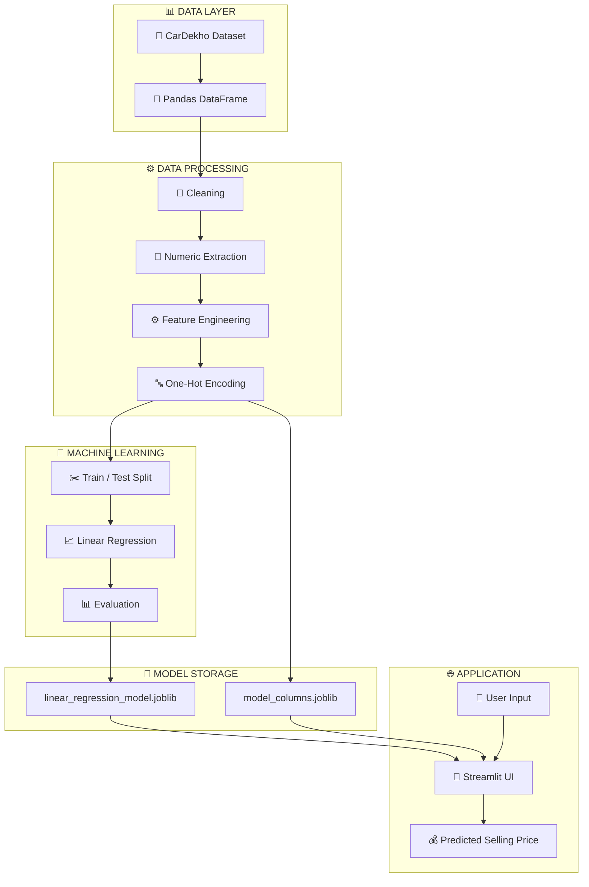
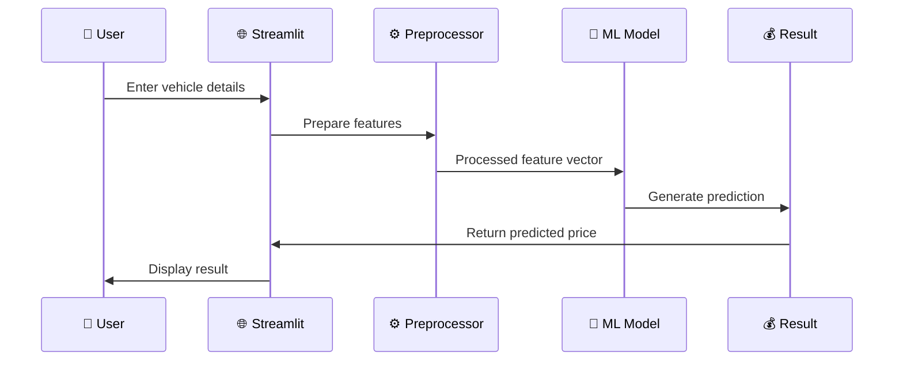

# 🚗 Vehicle Selling Price Prediction

<p align="center">


<br/>


</p>

<p align="center">

### 🚘 From Vehicle Data → Machine Learning → Price Prediction

**An end-to-end machine learning project for predicting used-vehicle selling prices.**

</p>

---

## 🌟 Project Overview

**Vehicle Selling Price Prediction** is an end-to-end Machine Learning project that analyzes used-car data and predicts the **selling price of a vehicle** based on its specifications, usage, ownership history, fuel type, transmission, brand, and other characteristics.

The project covers the complete ML workflow:

```text
📥 Data Collection
       ↓
🧹 Data Cleaning
       ↓
🔍 Exploratory Data Analysis
       ↓
⚙️ Feature Engineering
       ↓
🔤 Categorical Encoding
       ↓
✂️ Train / Test Split
       ↓
🤖 Linear Regression
       ↓
📊 Model Evaluation
       ↓
💾 Model Serialization
       ↓
🌐 Streamlit Application
       ↓
💰 Vehicle Price Prediction
```

---

# 🎯 Objective

The primary goal is to build a practical ML system that can estimate the selling price of a used vehicle from historical vehicle information.

### 🔮 Input

Vehicle specifications and marketplace information.

### 💰 Output

> **Predicted Vehicle Selling Price**

---

# 🚘 Dataset

The project uses the **Vehicle Dataset from CarDekho** downloaded through KaggleHub.

The analysis works with vehicle attributes such as:

| 🚗 Feature      | 📌 Description       |
| --------------- | -------------------- |
| `name`          | Vehicle name         |
| `year`          | Manufacturing year   |
| `selling_price` | Target selling price |
| `km_driven`     | Kilometres driven    |
| `fuel`          | Fuel type            |
| `seller_type`   | Seller category      |
| `transmission`  | Transmission type    |
| `owner`         | Ownership history    |
| `mileage`       | Vehicle mileage      |
| `engine`        | Engine capacity      |
| `max_power`     | Maximum power        |
| `torque`        | Engine torque        |
| `seats`         | Number of seats      |

---

# 🔍 Exploratory Data Analysis

The project performs both **univariate** and **bivariate** analysis.

### 📊 Numerical Analysis

The following variables are explored:

```text
📅 Year
💰 Selling Price
🛣️ Kilometres Driven
⛽ Mileage
⚙️ Engine
🚀 Max Power
🔧 Torque
💺 Seats
```

Visualizations include:

* 📊 Distribution plots
* 📈 Histograms
* 🔥 Correlation heatmap
* 📍 Scatter plots
* 📉 Feature vs. selling-price analysis

### 🏷️ Categorical Analysis

The project analyzes:

```text
⛽ Fuel
👤 Seller Type
⚙️ Transmission
👨‍🔧 Owner
🚘 Brand
```

Using:

* 📊 Count plots
* 📦 Box plots
* 🔎 Frequency analysis

---

# ⚙️ Data Preprocessing

Real-world vehicle data contains mixed formats and missing values, so preprocessing is an important part of this project.

### 🧹 Missing Values

The notebook identifies missing values in:

```text
⛽ Mileage
⚙️ Engine
🚀 Max Power
🔧 Torque
💺 Seats
```

### 🔢 Numeric Extraction

String-based numerical values are cleaned and converted into numeric values.

For example:

```text
"1248 CC"
     ↓
1248
```

```text
"74 bhp"
     ↓
74
```

This makes the variables suitable for machine learning.

---

# 🧠 Feature Engineering

One of the important improvements is extracting the **vehicle brand** from the vehicle name.

```text
"Maruti Swift Dzire"
          ↓
       "Maruti"
```

A new feature is created:

```text
🏷️ brand
```

The notebook also calculates:

```text
📅 car_age = 2024 - manufacturing_year
```

The original:

```text
name
year
```

columns are then removed after the engineered features are created.

---

# 🔤 Categorical Encoding

Categorical variables are transformed using **One-Hot Encoding**.

Encoded variables include:

```text
⛽ Fuel
👤 Seller Type
⚙️ Transmission
👨‍🔧 Owner
🏷️ Brand
```

This converts categorical information into numerical features that can be processed by the regression model.

---

# 🧬 Machine Learning Pipeline


---

# 🏗️ System Architecture



---

# 🤖 Machine Learning Model

The project uses:

## 📈 Linear Regression

Linear Regression is used as the baseline regression model for predicting vehicle selling prices.

```python
from sklearn.linear_model import LinearRegression

model = LinearRegression()

model.fit(X_train, y_train)

y_pred = model.predict(X_test)
```

### 🧩 Training Configuration

| ⚙️ Parameter     | Value             |
| ---------------- | ----------------- |
| 🤖 Algorithm     | Linear Regression |
| 🎯 Problem       | Regression        |
| 📚 Training Data | 80%               |
| 🧪 Testing Data  | 20%               |
| 🔀 Random State  | 42                |
| 🎯 Target        | `selling_price`   |

---

# 📊 Model Evaluation

The model is evaluated using four regression metrics:

### 📏 MAE

**Mean Absolute Error**

Measures the average absolute difference between actual and predicted prices.

### 📐 MSE

**Mean Squared Error**

Penalizes larger prediction errors more heavily.

### 📊 RMSE

**Root Mean Squared Error**

Provides error in the same unit as the target.

### 🎯 R² Score

Measures how well the model explains variation in vehicle selling prices.

```text
📊 Evaluation Pipeline

Actual Price
     │
     ├──────────────┐
     │              │
     ▼              ▼
Predicted Price → Error Metrics
                     │
          ┌──────────┼──────────┐
          ▼          ▼          ▼
        MAE         RMSE       R²
```

> 📌 Exact metric values should be taken from the final notebook execution rather than hard-coded into the README.

---

# 💾 Model Serialization

The trained model is saved using **Joblib**.

```text
📦 Model Artifacts

├── 🤖 linear_regression_model.joblib
└── 🧩 model_columns.joblib
```

`model_columns.joblib` is especially important because the Streamlit application needs to reproduce the same one-hot encoded feature structure used during training.

---

# 🌐 Streamlit Application

The project includes an interactive Streamlit application that allows users to:

### 🔎 Explore Vehicle Information

Users can select a vehicle and view details such as:

```text
🚗 Vehicle
📅 Year
💰 Selling Price
🛣️ Kilometres Driven
⛽ Mileage
⚙️ Engine
🚀 Max Power
🔧 Torque
💺 Seats
```

### 🔮 Predict Vehicle Price

Users can provide vehicle characteristics and receive an estimated selling price.

---

# 🔄 Prediction Flow

```text
👤 USER
  │
  ▼
🚗 Enter Vehicle Details
  │
  ▼
🔤 Apply Encoding
  │
  ▼
🧩 Match Training Columns
  │
  ▼
🤖 Linear Regression Model
  │
  ▼
💰 Predicted Selling Price
```

---

# 🖥️ Application Architecture



---

# 📁 Project Structure

```text
🚗 Vehicle-Selling-Price-Prediction/
│
├── 📓 Vehicle.ipynb
│
├── 🌐 app.py
│
├── 🤖 linear_regression_model.joblib
│
├── 🧩 model_columns.joblib
│
├── 📦 display_cars.joblib
│
├── 📄 requirements.txt
│
└── 📖 README.md
```

---

# 🛠️ Technology Stack

<p align="center">

| 🧰 Technology   | 🎯 Purpose                |
| --------------- | ------------------------- |
| 🐍 Python       | Programming               |
| 🐼 Pandas       | Data Processing           |
| 🔢 NumPy        | Numerical Computing       |
| 📊 Matplotlib   | Visualization             |
| 🎨 Seaborn      | Statistical Visualization |
| 🤖 Scikit-learn | Machine Learning          |
| 💾 Joblib       | Model Persistence         |
| 🌐 Streamlit    | Web Application           |
| ☁️ Google Colab | Development               |
| 📦 KaggleHub    | Dataset Download          |

</p>

---

# 🚀 Installation

Clone the repository:

```bash
git clone https://github.com/<your-username>/Vehicle-Selling-Price-Prediction.git

cd Vehicle-Selling-Price-Prediction
```

Install dependencies:

```bash
pip install -r requirements.txt
```

Example:

```text
pandas
numpy
matplotlib
seaborn
scikit-learn
joblib
streamlit
kagglehub
```

---

# ▶️ Run the Application

Start Streamlit:

```bash
streamlit run app.py
```

Then open the local URL provided by Streamlit.

```text
🌐 Streamlit
     ↓
👤 Vehicle Information
     ↓
🤖 ML Model
     ↓
💰 Estimated Selling Price
```

---

# ☁️ Google Colab Deployment

The notebook also demonstrates running Streamlit from Google Colab using a tunneling service.

Typical workflow:

```text
☁️ Google Colab
      ↓
📓 Execute Notebook
      ↓
🤖 Train Model
      ↓
💾 Save Model
      ↓
🌐 Start Streamlit
      ↓
🔗 Create Tunnel
      ↓
🌍 Public Application
```

---

# 🔐 Security Warning

⚠️ **Never commit API keys, authentication tokens, passwords, or private credentials to GitHub.**

The current notebook contains an ngrok authentication token.

Before publishing:

```text
❌ Exposed Token
      ↓
🔄 Revoke / Rotate
      ↓
🔐 Store Secret Securely
      ↓
✅ Safe Repository
```

Use environment variables or a secrets manager instead of hard-coding credentials.

---

# 📚 What I Learned

This project helped strengthen my understanding of:

### 🧹 Data Engineering

* Missing-value analysis
* Data cleaning
* String-to-numeric conversion

### 📊 Data Analysis

* Univariate analysis
* Bivariate analysis
* Correlation analysis
* Distribution analysis

### ⚙️ Feature Engineering

* Brand extraction
* Car-age calculation
* One-hot encoding

### 🤖 Machine Learning

* Train-test splitting
* Linear Regression
* Regression metrics
* Model persistence

### 🌐 Deployment

* Streamlit application development
* Loading serialized models
* Building interactive prediction workflows

---

# 🚀 Future Improvements

The current model provides a strong baseline, but there is significant room for improvement.

### 🤖 Model Improvements

* [ ] 🌳 Random Forest Regressor
* [ ] ⚡ Gradient Boosting
* [ ] 🚀 XGBoost
* [ ] 🧠 Neural Network
* [ ] 🔍 Hyperparameter Optimization
* [ ] 🔄 Cross Validation
* [ ] 🧪 Model Comparison
* [ ] 📊 Feature Importance
* [ ] 🎯 Advanced Error Analysis

### 🌐 Application Improvements

* [ ] 🎨 Modern dashboard UI
* [ ] 📊 Interactive price analytics
* [ ] 🚘 Vehicle comparison
* [ ] 📈 Price trend analysis
* [ ] 🗺️ Location-based analysis
* [ ] 📥 Prediction report download
* [ ] ☁️ Cloud deployment
* [ ] 📱 Mobile-responsive interface

---

# 🗺️ Future Architecture

```text
                 🚗 VEHICLE AI
                     │
       ┌─────────────┼─────────────┐
       ▼             ▼             ▼
   📊 ANALYSIS   🤖 PREDICTION   📈 INSIGHTS
       │             │             │
       └─────────────┼─────────────┘
                     ▼
              🌐 SMART DASHBOARD
                     │
          ┌──────────┼──────────┐
          ▼          ▼          ▼
       💰 PRICE    🚘 COMPARE   📊 ANALYZE
```

---

# ⭐ Project Highlights

```text
🚗 Real-World Vehicle Dataset
        +
🧹 Data Cleaning
        +
📊 Exploratory Data Analysis
        +
⚙️ Feature Engineering
        +
🤖 Machine Learning
        +
📈 Model Evaluation
        +
💾 Model Persistence
        +
🌐 Streamlit
        =
🚀 End-to-End Vehicle Price Predictor
```

---

# 🏆 Project Status

```text
📥 Data Collection       ✅
🧹 Data Cleaning         ✅
🔍 EDA                   ✅
⚙️ Feature Engineering  ✅
🔤 Encoding             ✅
🤖 Model Training       ✅
📊 Evaluation           ✅
💾 Model Saving         ✅
🌐 Streamlit App        ✅
🚀 Future Optimization  🔄
```

### 🟢 Status: Completed Baseline Model

---

# 👨‍💻 Author

## **Aravind**

🎓 AI & Data Science Student
🧠 Machine Learning Enthusiast
🤖 AI Developer
📊 Data Science Explorer
🚀 Building practical AI systems

---

# ⭐ Support The Project

If you found this project interesting:

⭐ **Star** the repository
🍴 **Fork** the project
🐛 **Report** an issue
💡 **Suggest** an improvement
🔗 **Share** the project

---

<p align="center">

## 🚗 Data → 🧠 Intelligence → 💰 Prediction → 🚀 Impact

### **Turning vehicle data into intelligent pricing decisions.**

⭐ **Star this repository if you found it useful!** ⭐

</p>
